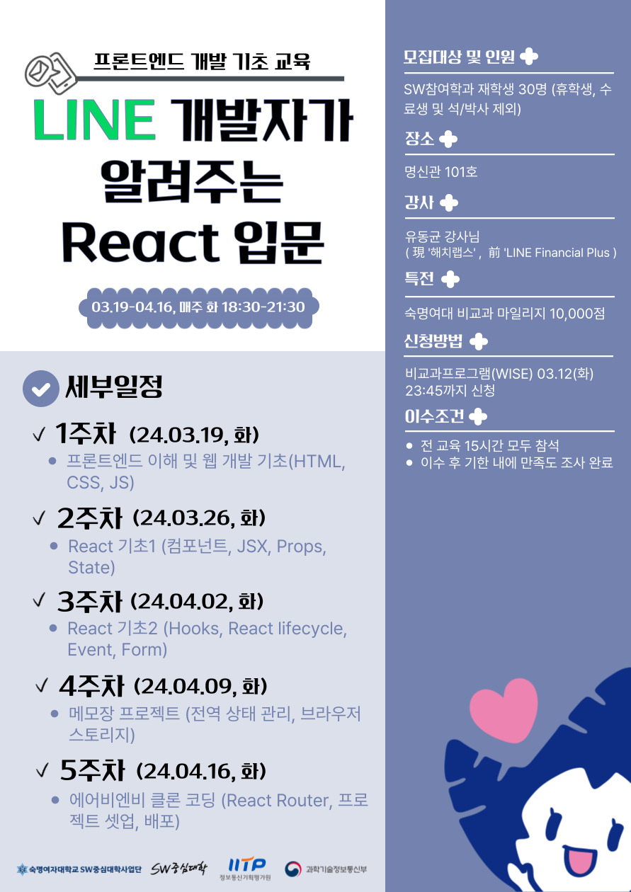
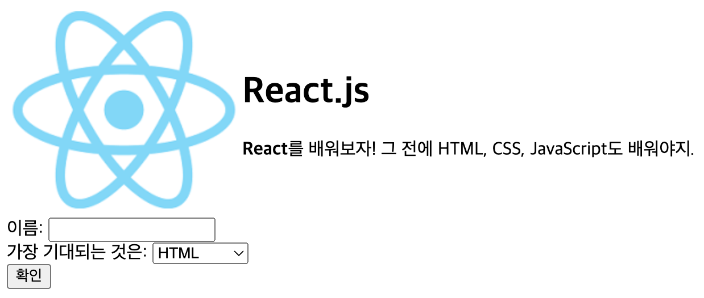
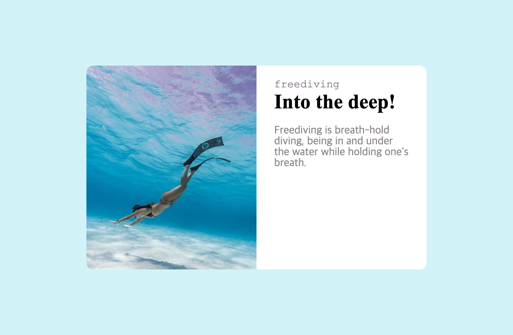

  <h1>2024-Front-end-fundamentals-training</h1>
  
[소프트웨어중심대학] LINE 개발자가 알려주는 React 입문

  

 

## 🗂️ 목차

1. [**프로그램 소개**](#1)
2. [**프로그램 일정**](#2)
3. [**실습**](#3)

 

## 💡 프로그램 소개

1. 프로그램명: LINE 개발자가 알려주는 React 입문

2. 일시: 24-03-19, 26, 04-02, 09, 16 (매주 화 5주), 18:30 ~ 21:30 (3h\*5회)

3. 장소: 숙명여자대학교 명신관 101호

4. 강사: 유동균 강사님 (現 '해치랩스', 前 'LINE Financial Plus')

5. 참여 대상: SW참여학과 재학생 30명

- 인공지능공학부(IT공학전공), 데이터사이언스전공(소프트웨어융합전공), 컴퓨터과학전공(CS)

 

🔗 [**[소프트웨어중심대학] LINE 개발자가 알려주는 React 입문 페이지 바로가기!**](https://sw.sookmyung.ac.kr/modules/board/bd_view.html?no=62&id=sw_notice&p=1&or=bd_order&al=asc)  

> 새 창 열기 방법 : CTRL+click (on Windows and Linux) | CMD+click (on MacOS)

 

## 📆 프로그램 일정

| 주차  |     날짜      |                           내용                           |
| :---: | :-----------: | :------------------------------------------------------: |
| 1주차 | 24.03.19 (화) |      프론트엔드 이해 및 웹 개발 기초(HTML, CSS, JS)      |
| 2주차 | 24.03.26 (화) |        React 기초1 (컴포넌트, JSX, Props, State)         |
| 3주차 | 24.04.02 (화) |    React 기초2 (Hooks, React lifecycle, Event, Form)     |
| 4주차 | 24.04.09 (화) |   메모장 프로젝트 (전역 상태 관리, 브라우저 스토리지)    |
| 5주차 | 24.04.16 (화) | 에어비엔비 클론 코딩 (React Router, 프로젝트 셋업, 배포) |

 

## 💻 실습

|                                         Lab01 - HTML                                         |
| :------------------------------------------------------------------------------------------: |
|  |

|                                         Lab02 - CSS                                         |
| :-----------------------------------------------------------------------------------------: |
|  |

 
